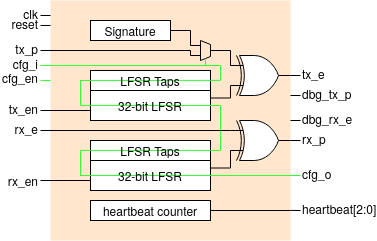
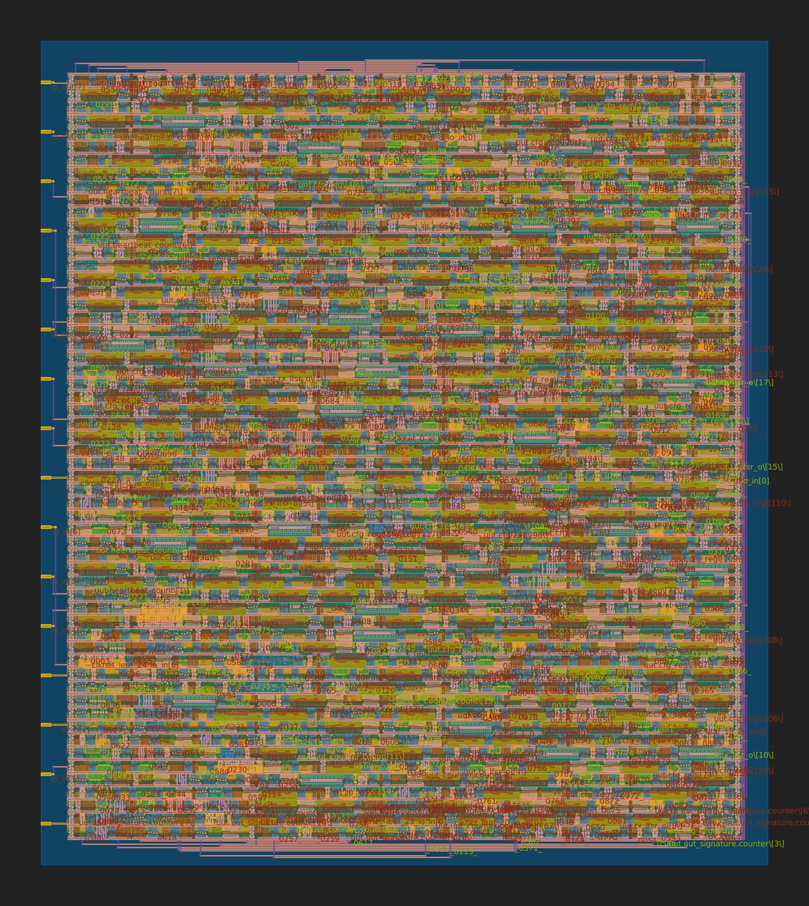

  

# XOR Stream Cipher Circuit
This repository builds an XOR stream cipher circuit for participation in Tiny Tapeout 3. This repository contains the design files to simulate, perform hardware tests on an FPGA and through the infrastructure provided by TinyTapeout generate manufacturable ASIC layouts.

<figure style="display:inline-block;" >

<figcaption style="text-align:center;"> Fig.1 - Dual XOR Cipher block diagram</figcaption>
</figure>

The circuit is based around a 32-bit programmable Galois LFSR for generating the key stream, and an XOR gate for combining it with a plaintext or cipher stream. When a plaintext stream is used, the result in an encrypted bitstream while when a cipher stream (encrypted) is used the original plaintext is returned. Figure 1 presents the block diagram of the system. Detailed information is presented below. 

## Background

### What is an XOR stream Cipher ? 
An XOR stream cipher is a type of symmetric-key encryption algorithm that encrypts data one bit or byte at a time, in a continuous stream. In a stream cipher, the encryption key is combined with a stream of pseudo-random bits or bytes to generate a sequence of cipher symbols, which are then combined with the plaintext message using the XOR (exclusive OR) operation to generate the ciphertext.

Unlike block ciphers, which encrypt fixed-size blocks of plaintext at a time, stream ciphers can encrypt data of any size in a continuous stream, making them well-suited for real-time communication applications such as wireless communications or internet telephony. Stream ciphers are also often faster and more efficient than block ciphers, since they require less computation and memory.

However, stream ciphers can be vulnerable to certain types of attacks, such as known-plaintext attacks or stream cipher resynchronization attacks, if the key stream is not properly generated or the same key stream is used multiple times.

### Galois LFSR
An LFSR is a shift register whose output bit is a linear function of its previous state. In a Galois LFSR, the linear function is implemented using exclusive-OR (XOR) operations between selected bits of the register. The XOR feedback taps should be chosen in a way that generates a maximal length sequence, which is a pseudo-random sequence of bits that has the longest possible period for a given register length.

The Galois LFSR operates by shifting the bits in the register to the right, with the rightmost bit being discarded and a new bit being added at the leftmost position. The new bit is generated by performing XOR operations between selected bits of the register, as determined by the feedback taps. The sequence of bits generated by the LFSR is periodic, with the period being determined by the size of the register and the feedback taps used.

## Implementation
The design has three major components: 
 1) **Programmable galois LFSR** - Generates the key stream based on a Pseudo Random Binary Sequence (PRBS). It is implemented as a 32-bit Galois LFSR whose initial state and taps are programmable. Therefore a user-defined polynomial and a user-defined intial state can be configured.  
 2) **XOR gate** - The XOR gate combines the key stream with the plaintext or ciphertext streams to encryption or decryption respectively.
 3) **Configuration shift register** - Taking the form of a 130-bit serial shift register allows the configuration of the LFSR state and taps registers and also some input/output.

Two channels are used for concurrent transmission and reception. 

## Pinouts
|     |     |     |
| --- | --- | --- |
| **Port Name** | **Direction** | **Description** |
| clk | input | System clock (FPGA=10MHz, TinyTapeout=12.5KHz) |
| rst | input | Active high synchronous reset |
| tx_p | input | Plaintext bitstream for transmission |
| cfg_i | input | Configuration input to the 130-bit serial shift register |
| cfg_en | input | Active high configuration enable |
| tx_en | input | Transmit channel enable |
| rx_e | input | Encrypted bitstream for reception |
| rx_en | input | Receive channel enable |
| tx_e | output | Encrypted bitstream for tranmission |
| dbg\_tx\_p | output | Decrypted transmit bistream (debug pin, disable by default) |
| dbg\_rx\_e | output | Encrypted receive bistream (debug pin, disable by default) |
| rx_p | output | Decrypted bitstream for reception |
| cfg_o | output | Configuration output from the 130-bit serial shift register |
| heartbeat\[2:0\] | output | Three MSBs from a hearbeat counter |

## Chip Layout

<figure style="display:inline-block;" >

<figcaption style="text-align:center;">Fig.1 - 2D preview of the Integrated Circuit (IC)</figcaption>
</figure>

## FPGA Testing 
This section describes how to use this repository simulate and test the functionality of the DUT on an FPGA. Doing so, provides detailed decreases the odds the ASIC is non-functional

Two examples are provided that test the design both in simulation and on an FPGA. The Makefile located in the root of this repository can be used to setup and generate the bitstream of all the designs. Each example instantiates the Design Under Test (DUT) in a block diagram, drives it with a stimulus block and monitors it using both an embedded Integrated Logic Analyser (ILA) and board I/O. 
1. **<a href="./dual_xor_basic_arty35t_vivado">dual_xor_basic_arty35t_vivado</a>** - This example tests the configuration mechanism and encryption/decryption functionality with a loopback test. By means of a VIO, the stimulus block can be setup to configure the DUT once or periodically. Waveforms relating to the configuration pins (`cfg_i`, `cfg_o`, and `cfg_en`) can be monitored using the ILA while the value of the 130-bit configuration register can be monitored on the VIO. Alternatively the design can be configured once and the left to run indefinitely. The plaintext and deciphered streams are monitored and any mismatch updates the error counters.
2. **<a href="./dual_xor_signature_arty35t_vivado">dual_xor_signature_arty35t_vivado</a>** - This examples configures the DUT to use an internal 41-byte signature as the plaintext. The DUT is connected in loopback: the internal signature and transmitted in cipher form through the transmit channel and deciphered through the receive channel. A serial to parallel bock reads converts the deciphered bitstream into bytes which are then transmitted using a UART. The user can select to feed the ciphered or deciphered stream to the UART and compare the difference. 

FOSS flows for arty35t and ice40UP5k will be added shortly. More details in the corresponding directories.

These examples are intended to be built with Vivado 2020.2. First source the settings file and ensure that vivado is accessible on `$PATH` - e.g. `source /tools/Xilinx/Vivado/2020.2/settings.sh`. Then run `make basic_test` or `make signature_test` to build the individual projects or `make all` to build everything. After the build finishes the bitstream (`.bit`) and associated probes (`.ltx`) files will be available in the hw directory. If you ecounter any issues please feel free to open an issue and we'll sort it out. 

## ASIC Testing
Coming soon

# What is Tiny Tapeout?

TinyTapeout is an educational project that aims to make it easier and cheaper than ever to get your digital designs manufactured on a real chip!

Go to https://tinytapeout.com for instructions!

## How to change the Wokwi project

Edit the [info.yaml](info.yaml) and change the wokwi_id to match your project.

## How to enable the GitHub actions to build the ASIC files

Please see the instructions for:

* [Enabling GitHub Actions](https://tinytapeout.com/faq/#when-i-commit-my-change-the-gds-action-isnt-running)
* [Enabling GitHub Pages](https://tinytapeout.com/faq/#my-github-action-is-failing-on-the-pages-part)

## How does it work?

When you edit the info.yaml to choose a different ID, the [GitHub Action](.github/workflows/gds.yaml) will fetch the digital netlist of your design from Wokwi.

After that, the action uses the open source ASIC tool called [OpenLane](https://www.zerotoasiccourse.com/terminology/openlane/) to build the files needed to fabricate an ASIC.

## Resources

* [FAQ](https://tinytapeout.com/faq/)
* [Digital design lessons](https://tinytapeout.com/digital_design/)
* [Learn how semiconductors work](https://tinytapeout.com/siliwiz/)
* [Join the community](https://discord.gg/rPK2nSjxy8)

## What next?

* Share your GDS on Twitter, tag it [#tinytapeout](https://twitter.com/hashtag/tinytapeout?src=hashtag_click) and [link me](https://twitter.com/matthewvenn)!
