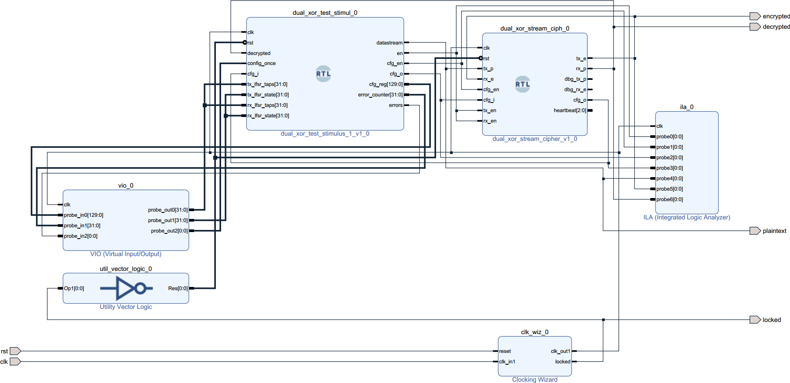
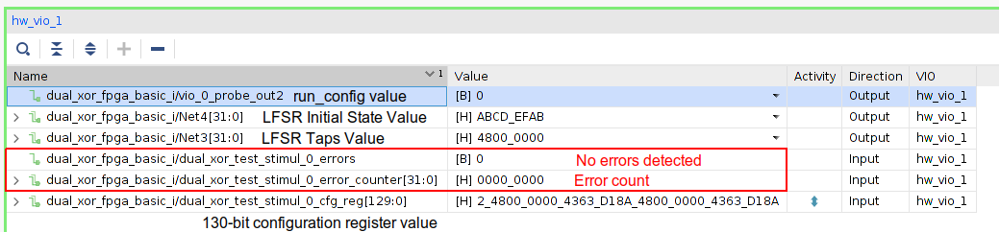
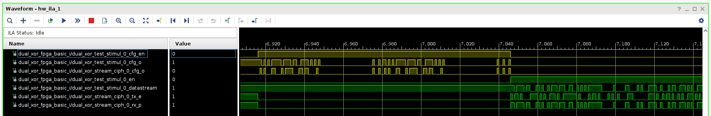

# Basic Test

This setup connects the DUT in loopback, and stimulus block sequences a test. There are two operation modes that differ based on the status of `config_once` pin:
1. **config_once=0** - The stimulus block periodically configures the DUT by serially shifting a 130-bit vector, the contents of which can be set using the Virtual Input Output (VIO) block, and afterwords lets the block run for a fixed amount of clock cycles. Figure 3 illustrates waveforms.
2. **config_once=1** - The stimulus block configures the DUT once and lets the design run indefinitely. 

<figure>

<figcaption>Figure 1 - Block diagram</figcaption>
</figure>

## Build
To build, ensure that the vivado is available on `$PATH`, then issue make. After the build process finishes, the bitstream and probe files can be found in the `hw` directory. 

**Note** - Set JTAG Frequency to 3MHz or less, otherwise the VIO and Integrated Logic Analyser (ILA) will not work properly. To do this, while in the Vivado Hardware Manager, close the target if its already open and then, navigate to Hardware Target Properties -> Properties -> PARAM -> FREQUENCY = 3000000. 

## Description

The VIO allows the user to specify value of the LFSR Taps and LFSR Initial State and monitor the old value shifted from the DUT after the design has been configured. The TX and RX LFSR are configured with identical values. 

The VIO also monitors the error counter inside the stimulus block that continuously monitor the plaintext provided to the transmit channel and the deciphered output from the receive channel.

<figure>

<figcaption>Figure 2 - Virtual Input Ouput (VIO)</figcaption>
</figure>

Figure 3 shows ILA waveforms, with the yellow ones corresponding to configuration and the green ones corresponding to the plaintext and ciphered bitstreams. Concerning configuration, the new configuration bitstream is serially pushed through the DUT `cfg_i` pin while the old one is shifted out of the DUT `cfg_o` pin. After 130 clock cycles the stimulus block will have exchanged the contents of its configuration register with those of the DUT. This process is similar to SPI, with the difference that the shift register is longer and spirals through the core blocks of the DUT. 

<figure>

<figcaption>Figure 3 - Integrated Logic Analyser (ILA) Expected Waveforms</figcaption>
</figure>

