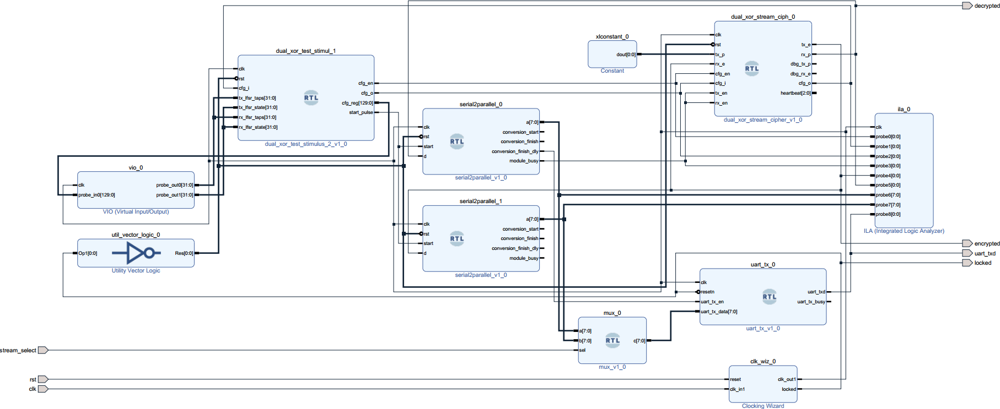
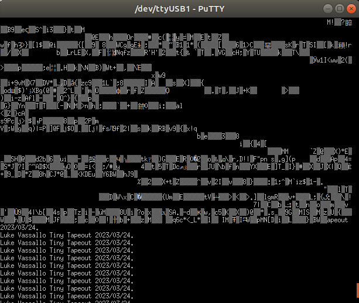
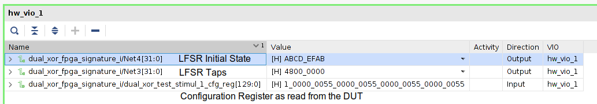
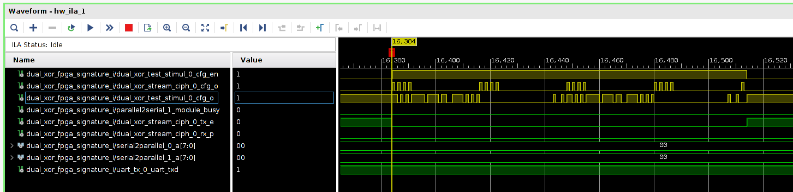
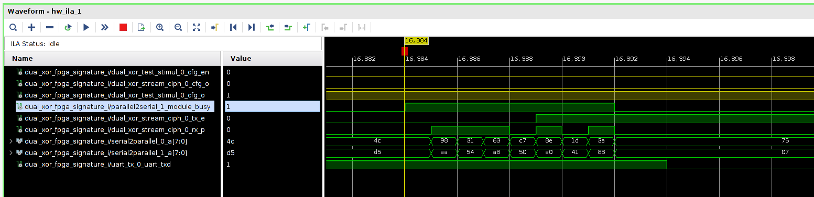

# Signature Test

This setup configures the DUT to select the internal 41-byte signature for transmission. The DUT is also connected in loopback such that the signature bitstream is encrypted, and then decrypted. A mechanism is additionally included to retrieve byte-sized chunks from the DUT's bitstreams and print them via UART at a baudrate of 115200. Figure 1 illustrates the block diagram of the system. 

<figure>

<figcaption>Figure 1 - Block diagram</figcaption>
</figure>

## Build
To build, ensure that the vivado is available on `$PATH`, then issue make. After the build process finishes, the bitstream and probe files can be found in the `hw` directory. 

**Note** - Set JTAG Frequency to 3MHz or less, otherwise the VIO and Integrated Logic Analyser (ILA) will not work properly. To do this, while in the Vivado Hardware Manager, close the target if its already open and then, navigate to Hardware Target Properties -> Properties -> PARAM -> FREQUENCY = 3000000. 

## Description

The stimulus block controls the sequence of test events in this example and does two things: 
1. It sets up the DUT with a 130-bit vector to choose the internal signature for transmission, LFSR taps and LFSR initial state.
2. It generates a one clock cycle pulse periodically to prompt the serial2parallel block to read 8-bits (equivalent to a single ascii character) from both plaintext and ciphered bitstreams for comparison. The value of  `stream_select` determines which byte is sent to the UART, and this value is controlled by a switch on the ARTY 35T development board.
 
 

<figure>

<figcaption>Figure 2 - Ciphered and deciphered signature in UART console</figcaption>
</figure>

 
Figure 2. shows the difference between the ciphered stream (`stream_select = 1'b0`) and the plaintext  (`stream_select = 1'b1`) as read from the uart output. The signature is comprised of my full name followed Tiny Tapeout and the project completion date.

<figure>

<figcaption>Figure 3 - Virtual Input Ouput (VIO)</figcaption>
</figure>

<figure>

<figcaption>Figure 4 - Integrated Logic Analyser (ILA) demonstrating configuration</figcaption>
</figure>

<figure>

<figcaption>Figure 5 -  Integrated Logic Analyser (ILA) demonstrating byte retrieval and transmission</figcaption>
</figure>

Figures 3 to show show the Virtual Input/Output and some excerpts from the Integrated Logic Analyser. 

